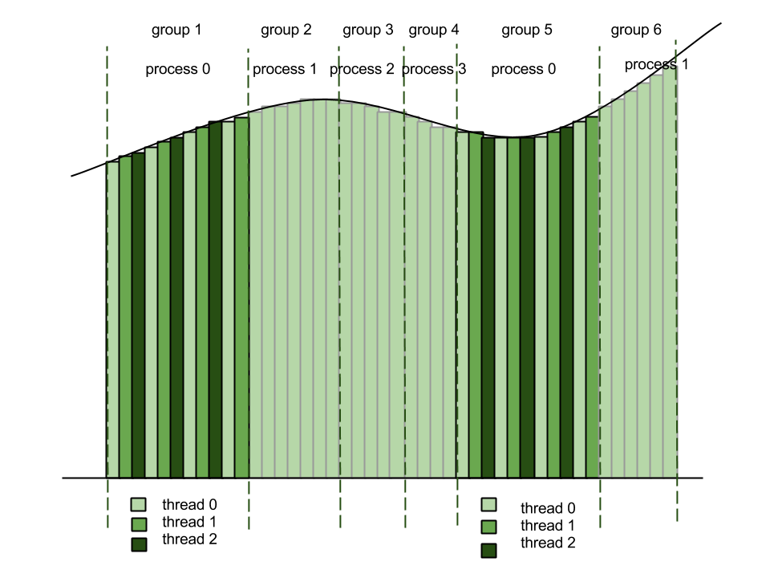

***********************************
Advanced Activity - Hybrid Striping
***********************************

For the striping to be completely analogous to the blocking functions we need to implement a hybrid striping version where processes as well as threads within processes will be striping. There are several different ways to do this, each of which require more careful thinking about how the striping should be performed. 

For finding the area under the curve we should consider the following questions: how should the data be split up? How often will each thread within a process be striping? How many rectangles will each thread within a process compute?

One way to think about the problem is that threads are responsible for one rectangle at a time, while processes are responsible for groups of rectangles. This means that each process will have a region that holds a certain amount of rectangles at each iteration. Within this region, threads are going over the rectangles in a striping fashion. 

	*The concept of groups of rectangles. The particular groups that are the stripes of process 0 are emphasized. Inside three threads within process 0 are striping.*

From the illustration above we can see how the concept of hybrid striping should look like. We may still wonder, however, how many rectangles should there be within a group, and how many groups should each process have? These questions are important to investigate, since we don't want the threads to be doing too little or too much work within a group. 

One way to go about solving this is to introduce a striping factor - a value that will tell us how much work should a thread do. In this case our striping factor would be the number of rectangles we want a particular thread to be responsible for. Once we set the striping factor, and knowing how many threads we have, we can find out how many rectangles there are within a group by calculating:

		**number of rectangles per group = t_striping_factor * number of threads**

Once we know how many rectangles there are, we can find out how many groups there are by calculating:

		**number of groups = total number of rectangles/number of rectangles per group**

Knowing how many groups there are and how many processes there are, we can also find out the value of the striping factor for the processes by calculating:

		**p_striping_factor = number of groups/number of processes**

**Your task:** Use these concepts to implement a function called handle_rectangles_hybrid_striping(struct area_t * area).

