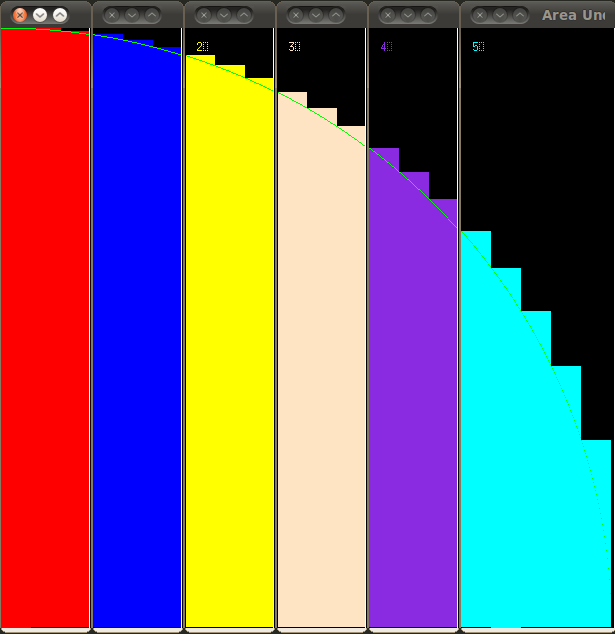

***********************************************
Finding the Area Under the Curve Using Blocking
***********************************************

Once each process has the number of rectangles it is responsible for it can start looping through this number, calculate and store the area one by one. If this loop is parallelized using OpenMP by default OpenMP will split the data equally amongst the threads. By each process or thread having its own set of rectangles to loop through, we have employed the concept of blocking as a way of parallel computation. Below are examples of how blocking looks like using various levels of parallel computing.

The next image shows how the blocking is done using OpenMP only. Each thread has its unique color. This was run on the head node of Macalester's LittleFe that has two cores.

Below is blocking using MPI only on 6 processes that find the area of a quarter circle.

Below is blocking unsing MPI and OpenMP. This was run a machine with a quad-core CPU using three processes (thus 12 colors).

