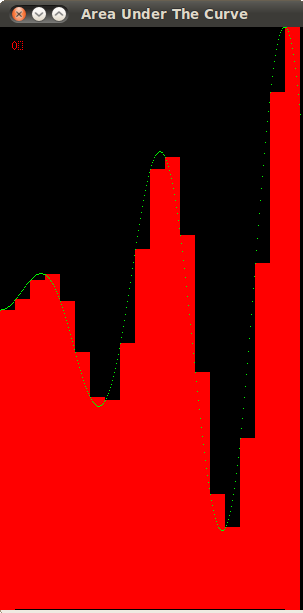

******************************
Computing Area Under the Curve
******************************

Overwiev
########

:Download the source code: :download:`area.tgz <area.tgz>`

The code that illustrates the computation of the area under the curve using parallel computing and/or distributed processing consists of a main .c file and several .h files. The files are as follows:

* **area.c** - contains the main function of the program
* **area.h** - performs the important calculations and calls other drawing routines
* **structs.h** - contains general information of some important structs and functions used
* **Xarea.h** - contains all functions that call X windowing drawing routines
* **colors.h** - contain coloring functions that call X drawing routines
* **MPEcolors.h** - contain coloring functions that call MPE drawing routines
* **MPEarea.h** - contains all functions that call the MPE drawing routines

:About the graphics in this program: For visualizing the computation of the area under the curve two graphics libraries were used: **Xlib** and **MPE (MPI Environment)**. Due to the nature of how each process opens and handles the display which depends on which library is used, Xlib was used for the blocking examples, whereas MPE was used for the striping examples. In the first several activities you will notice the absence of the MPE related header files. They will be included, however, in the later examples that involve striping. **Note:** you will not be asked to change these files. 

One of the main concerns of this program is how to decompose the region we are interested in computing among the processing units, based on how many nodes and/or threads are to be used and the number of rectangles specified. 
A serial version of the program computes the areas of each rectangle one by one, stores the areas and finally sums the stored areas up. The following image shows the effect of computing this problem in a serial fashion:

In a parallel version, the same steps are followed, except each thread deals with a smaller number of rectangles. Each thread keeps a sum of the areas of the rectangles they were responsible for and this value is private to this thread. In the final step, this value is added to a global sum variable. 

In a distributed version, each process also contains a piece of the overall problem size. Similarly to the parallel version, each process accumulates the sum on a private sum variable. In the final step each process communicates its private sum to the master process which then finally sums all the partial sums together for a final output. This is called reduction - we are reducing all the individual sums to a final one. 

The heterogeneous version combines the two versions. There we decompose the problem among processes, take the problem size each problem has and decompose it further among the threads. To obtain an overal sum, two reduction steps will need to be taken: one that reduces the sum from the threads and one that reduces the sum from the processes. 

The Program Structure
#####################

In order to help you understand the program, the following few chapters provide a walkthrough of the code separated into three parts: initialization, main computation and finalization. In the next chapter the data structures used in his program will be explained first, followed by the actual program structure.

The program can be run in many different ways, using a serial, parallel, distributed or heterogeneous (hybrid) version.

* **serial**: ./area.c-serial
* **parallel**: ./area.c-openmp
* **distributed**: mpirun -np [number of processes] ./area.c-mpi
* **heterogeneous**: mpirun -np [number of processes] ./area.c-mpi-openmp

Compiling the program
*********************

To compile each of the version listed above type:
	make *target*,
where target is the name of the executable. You can also type *make all* to compile all of the executables at the same time.
The make command takes the options NO_X11 and STRIPING. For instance if you type **make area.c-serial NO_X11=1**, you will compile the serial version that won't have a graphical output. 
Enabling the striping option will be discussed in the activities.

Command Line Options
********************

There are several command line options for running the program. If none are specified, there are default values. The options are:

* **-n**: number of rectangles
* **-l**: left x boundary of the domain
* **-r**: right x boundary of the domain
* **-f**: which mathematical function should be used; 1 is for linear, 2 is for circle, 3 is for sine.
* **-x**: 'display' or 'no-display' (without qoutation marks) to specify whether graphical output is needed or not. 'display' is default.
* **-g**: 'gap' or 'no-gap'. For blocking using MPI, each process opens its own X window, which are by default separated from each other for visibility. Specifying 'no-gap' will align the windows adjacent to each other. 'gap' is default.
* **-t**: throttle time in **seconds** used to slow down or speed up the visualization.

An example run command for the linear function from 100 to 600 whose area we wish to compute using 100 rectangles in serial would be:
	./area.c-serial -n 100 -l 100 -r 600 -f 1

.. Note:: The -r option for the circle can be at most 1, for sine at most pi (3.1416).
