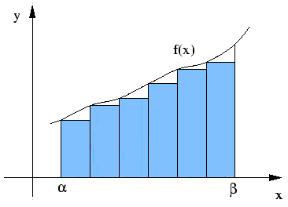
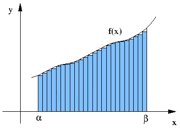

*******************************
Finding the Area Unde the Curve
*******************************

Integration or finding the area under a curve is a very important concept from calculus applied in life sciences, engineering and economics.

The basic concept behind finding the area under a curve is approximating the area with regular geometrical shapes whose areas we know how to calculate. In this example we approximate this area with rectangles.  

Two endpoints on the x-axis define the domain on which the area under the curve is located. We can split this region into numerous small rectangles. The more rectangles we choose, the smaller they become, and the closer they approximate the curve. Therefore, choosing a larger amount of rectangles yields to more accurate results.

	Approximating the area with rectangles

	The more rectangles there are, the better the approximation

.. note:: Theoretically, the number of rectangles can approach infinity. In the code samples found here the number of rectangles specified may approach a large number. (There are limitations to this which you will investigate in a separate activity.) An exception to this is using the visualized version. In that case you may not specify a number of rectangles larger than the domain you wish to compute the area on, because the width of an individual rectangle cannot be smaller than the pixel size of the screen used for display. Not using the visual version will allow you to specify large numbers.

There exist functions whose area we either know or can calculate exactly without integration. Such functions can provide a clear guideline to see how accurate our program is. Here we choose to examine the following functions:

* linear function *f* (*x*) = *x* in the positive range
* the unit circle in the range [0,1]
* *f* (*x*) = sin(*x*) in the range [0, pi ] 

The area of a linear function in the positive range is equivalent to the area of a triangle, which is :math:`1/2 * height * width`. 

The area of a quarter unit circle is :math:`1/4 * pi`. 

Finally, the area of the sin function in the range from 0 to pi is exactly 2. 

It is important to keep these facts in mind as they will help us determine the correctness of our program. 

.. note:: A default function is provided besides the three above for visual representation. The equation of the default function is: :math:`f(x) = a + x * sin(0.05 * x)` where :math:`a` is the right x coordinate the user can specify.