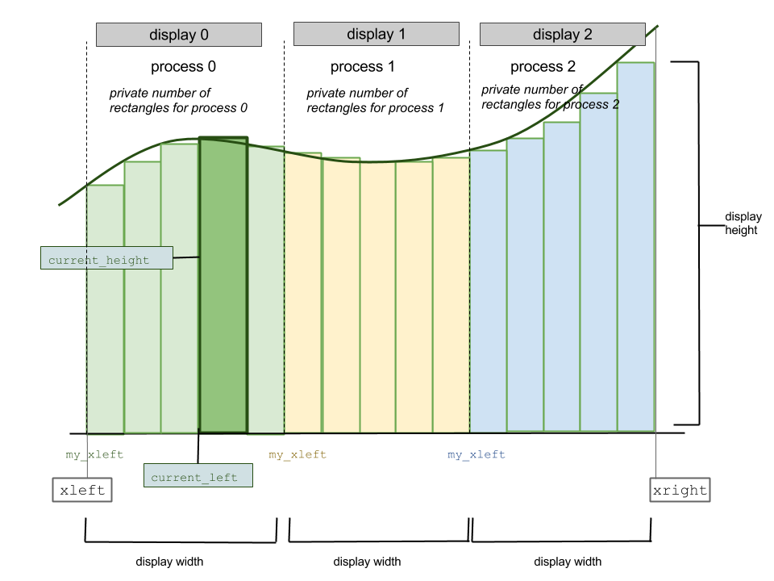
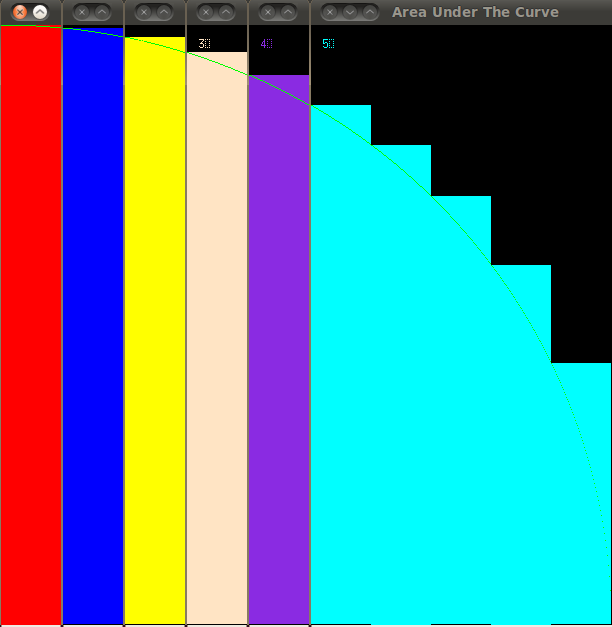

**************
Initialization
**************

The initialization of the program and setup of all default data takes place in the following functions:

	**main()**
		- the main function of the program is located in area.c

	**init_data()**
		- located in area.h, this function assigns default initial values to all necessary variables

	**area_under_curve()**
		- located in area.h, this function will set up the MPI and/or the OpenMP environment if specified, and it proceeds by calling all other functions that make up the core of the program which will be discussed in the next chapter

	**parse_args()**
		- located in area.h, this function interprets the command line options and overrides default values for which options have been specified.
		
	**setup_right_boundary()**
		- you will not be asked and you should not be needing to change this function. This function rescales the domain for certain mathematical functions, and ensures that the area under these functions will be computed within a correct domain.

		:About the circle and sine function: As mentioned before, in this program we will be calculating the area under the circle and sine functions within the specified domain. In order to visualize these computations we need to rescale the these two functions to have bigger dimensions. For demonstration purposes the drawing routines will only consider the rescaled versions. The calculation of the area will involve the original functions. Therefore you will notice special conditions involving the circle and sine functions, which you will not be asked to change as well. In case of the setup_right_boundary() function the spcial condition is that the rightmost boundary can be at most 1 for the unit circle and at most *pi* for the sine function.

	**setup_rectangles()**
		- this function sets up all the information that we need in order to calculate each rectangle's area

	If we want to use a display to visualize the program then the following functions will also be called at this point:
		**setup_window_height()**
			- located in Xarea.h. This function sets up the height of the X window.
		**setup_window_width()**
			- located in Xarea.h. This function sets up the width of the X window.
		**setupWindow()**
			- located in Xarea.h. This function will use the information about window dimensions to set up the X windows and make them appear on the screen.
		**moveWindow()**
			- located in Xarea.h. This function moves each X window to its desired position.
		**init_colors()**
			- located in colors.h. This function prepares the colors for later use.

What We Need to Know About Rectangles
#####################################

Below is a diagram that illustrates how the reactangles should be set up and the important variables that we need to calculate and keep track of.

Overall Domain
**************

The image shows a sample curve whose area that stretches from *xleft* to *xright* we wish to compute. The variables *xleft* and *xright* are custom defined on the command line, otherwise a default value for *xleft* and *xright* is defined in the init_data() function.

:Warning: This program is for demonstration purposes only and does not accept negative values for either *xleft* or *xright*. 

Number of Rectangles
********************

The image also represents an instance of blocking. The blocks are color coded. We can see that process 0 possesses green rectangles, process 1 yellow and process 2 blue rectangles. Each process has its own private number of rectangles. All private amounts of rectangles sum up to the total number of rectangles that we either set up as a default value or retrieve from the command line. Since we start with the overall number of rectangles, and knowing the number of processes used, we can easily find the number of private rectangles simply by dividing the total number of rectangles by the number of processes. The code exceprt below shows how this is done.

.. literalinclude:: area.h
	:language: c
	:lines: 135-159

Notice that in this function the last process attains the remaining number of rectangles in case the number of rectangles is not evenly divisible by the number of processes.

.. Note:: The diagram above assumes that MPI was initialized and that the program is being executed using multiple processes. If MPI is not being used, then the program is being executed using a single process. Regardless of whether the program is being run in serial or parallel, the private number of rectangles will equal the total amount of rectangles.

Dimensions of a rectangle
*************************

In order to find the area of a rectangle, we need to know its width and height. nowing the width of the domain under the curve which is the distance from *xleft* to *xright* and the number of rectangles, we can find the width of each rectangle by dividing these two varibles.Finding the height of each rectangle required slightly more information. 

In order to compute each rectangle within a process we need to know where on the domain from *xleft* to *xright* each process begins. This coordinate we call *my_xleft*. This variable is computed as so:

.. literalinclude:: area.h
	:language: c
	:lines: 153

This variable is a private variable to each process letting the process know where its region has begun. Once the process also knows its private number of rectangles, the full span of each process is known. This span is simply the private number of rectangles multiplied by the width of each rectangle. In the code above that is the *rect->private_num_rect* * *rect->width* part. The next step is to multiply this part by the *rank* of the process, in order to advance this region by the number of rectangles. Finally we need to offset this region by *xleft*. 

.. Warning:: Observe that *my_xleft* is defined before the last process gets any additional number of rectangles. Up until the if statement, the last process has as many rectangles as all other processes. This means that *my_xleft* of the last process will be *rect->private_num_rect* * *rect->width* away from *my_xleft* of the process before. Had *private_num_rect* been any bigger then the last process will be offset to far away from and its *my_xleft* would not be adjacent to the last rectangle of the process before the last.

Once we know where each process begins all we need to do is loop from *my_xleft* until the private number of rectangles. We increment *my_xleft* by the rectangle width as we progress in the computational region of each process. This way a variable called *current_left* is calculated, which is the left x-coordinate of each individual rectangle. Passing this variable into the mathematical equation of the curve will yield the *current_height* variable which can finally be used to compute the area. This is part of the main computation of the program which will be discussed in the next chapter. 

.. Note:: If MPI is not being used *my_xleft* is simply *xleft*.

ACTIVITY 0 - Load Balancing of the Rectangles
#############################################

Run the program again like this:
	mpirun -np 6 area.c-mpi -n 10 -f 2

You should get a result that looks like this:

What is wrong with this image? 

When using MPI, one of the first main steps is to distribute a certain amount of rectangles to each process (if MPI is not used then the master process gets all the rectangles). The last process will gain the remainder of the rectangles in case the total number of rectangles is not divisible by the number of processes used. 

By dividing the rectangles in that way, we can see that the last process will always get an extra 0 through *n*-1 rectangles. For this particular problem being run on a regular computer or a small cluster such as LittleFe, this may not seem like a big issue, since the maximum number of extra rectangles the last process gets is relatively small. By running a small number of rectangles, however, we can notice how the last process will have a relatively large number of rectangles to deal with than the others. We say there is improper load balancing. In addition, suppose we are working on a much larger system. This can pose a problem given that the largest amount of extra rectangles can be up to *n*-1 if *n* is too large. The first task geared towards improving this code would be to ensure proper load balancing of the data among the processes such that the number of rectangles are as evenly distributed among the processes as possible

**Your task:** change the setup_rectangles() function to have a more even distribution of rectangles.

**Tip:** consider how to take the remainder/extra rectangles and divide them amongst the processes. 

The solution to this problem can be obtained by downloading the folder :download:`area_load_balancing <area_load_balancing.tgz>`. The solution will be included in all other activities, therefore it is recommended that you finish this activity first before proceeding. You may use your own solution to work with the rest of the activities.
