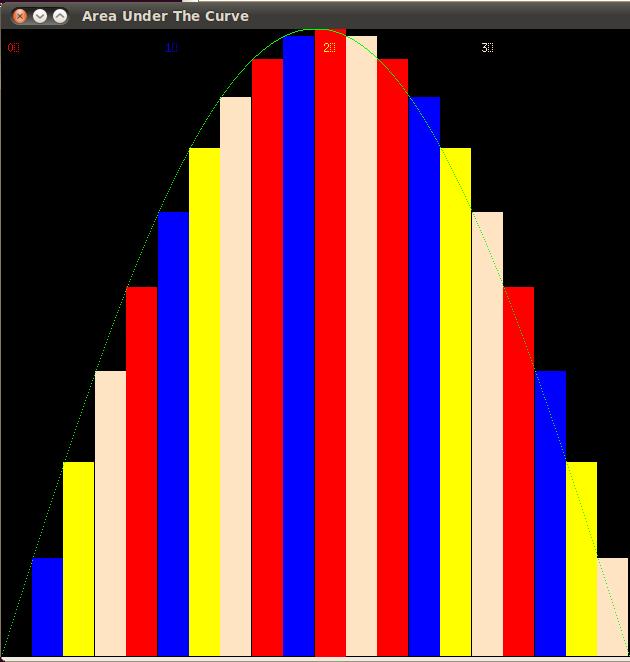
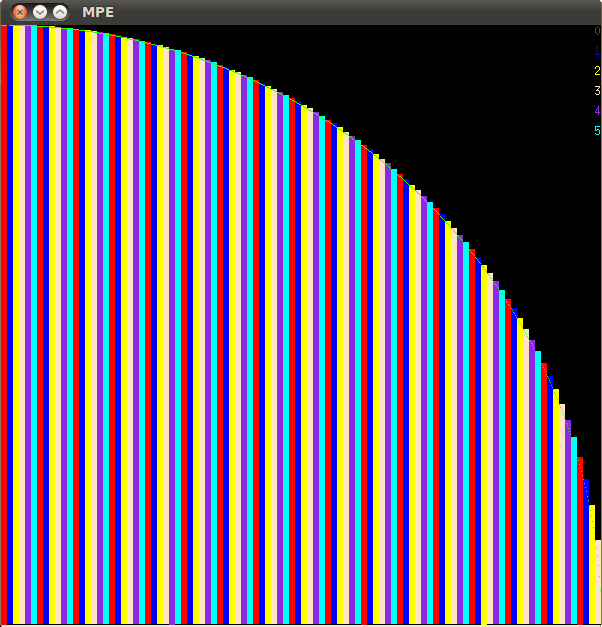
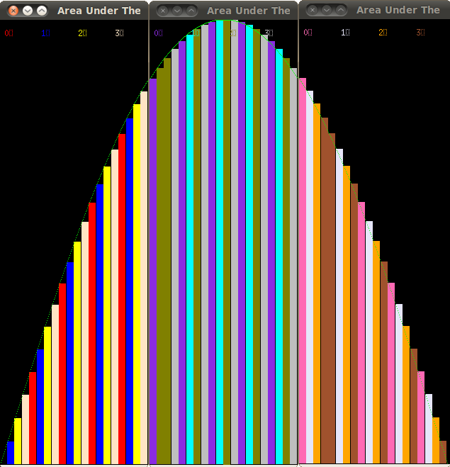

***********************************************
Finding the Area Under the Curve Using Striping
***********************************************

As stated before blocking may not always be desirable. In case of the problem of finding the area under the curve which way of data decomposition we choose doesn’t have an impact on the performance of our program. In some other situations, however, it is possible that we encounter a non-uniform distribution of data. In this case we might employ striping rather than blocking. Striping can be done for the processes only, for the threads only or both. The main difference in striping and blocking is that this time the processes do not require a subset of their own rectangles. Instead, the loop will go through all rectangles.

In the next chapter there will be a few activities asking you to implement striping. Depending on whether you are running the program in parallel or distributed or both, the striping effect will be different. In serial, there will be no change from blocking. 

Below are some examples of how the results of your solutions should look like. Depending on the type of hardware you use, the colors, amount and frequency of striping may differ.

Here is an example of striping using OpenMP only on a computer with a quad-core CPU (one process, sine function):

Here is an example of striping using MPI only using 6 processes.

In a hybrid version we can have a combination of blocking+striping as well as striping+striping.
Blocking+striping is achieved when the processes are blocking, but the threads within each process are striping:

Striping+striping is achieved when the processes as well as the threads within each process are striping. This will be discussed in a later chapter.
